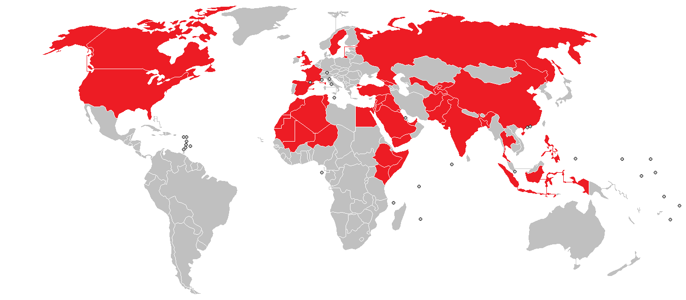
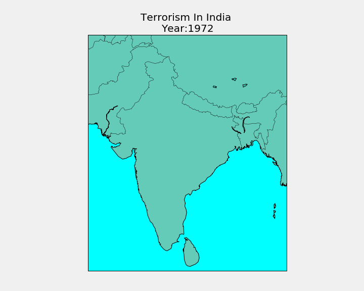
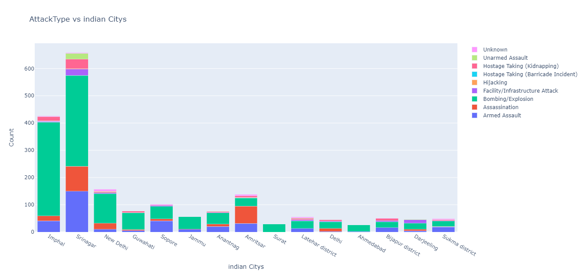

# Exploratory Data Analysis (EDA) on Terrorism(1970 to 2017)
## By <a class="social-icon" href="https://www.linkedin.com/in/chitransh-tarsoliya-33639b172/" target="_blank">Chitransh Tarsoliya </a>
  
<a class="social-icon" href="https://github.com/i-am-creator/" target="_blank">Github</a>

# Table of contents
a. **Loading and cleaning**

-  import
-  load data
-  frist look
-  filter out important features
-  Basic info about features and Null value count & persantage
-  Removing nan values

b. [**Analysis**](#Analysis)

- [country wise total terror incident](#1)
  - [top 10 country](#1_1)
- [AttackType vs country](#2)
- [Analyse according to region](#3)
    - [Total terror attacks and killed](#3_1)
    - [AttackType vs Region](#3_2)
    - [Year wise terror attacks](#3_3) 
    - [Year wise terror killed](#3_4)
- [Year wise total terror incident](#4)
- [Year wise terror attacks in Top 10 country](#5) 
- [15 Most active group](#6)
- [Attacking Methods by Terrorists](#7)
- [Attacking Targets by Terrorists](#8)
- [success vs fail](#9)

c. **[Terrorism in India](#Terrorism_in_India)**

- [animation](#a)
- [Most atacked cityies](#b)
- [Attacking Methods by Terrorists](#c)
- [Attacking Targets by Terrorists](#d)
- [15 Most active group](#e)
- [Activity of most active groups](#f) 

# **Analysis** 
----

### country wise total terror incident 

### top 10 country 
.png)

### AttackType vs country 
.png)

### Analyse according to region 
#### Total terror attacks and killed 
.png)

#### AttackType vs Region 
.png)

#### Year wise terror attacks  
.png)

#### Year wise terror killed  
.png)

### Year wise total terror incident 
.png)

### Year wise terror attacks in Top 10 country 
.png)

### 15 Most active group 
.png)

### Attacking Methods by Terrorists 
.png)

### Attacking Targets by Terrorists 
.png)

### success vs fail 
.png)

# **Terrorism in India** 

### animation  

### Most atacked cityies 

### Attacking Methods by Terrorists 
.png)

### Attacking Targets by Terrorists 
.png)

### 15 Most active group 
.png)

### Activity of most active groups  
.png)

